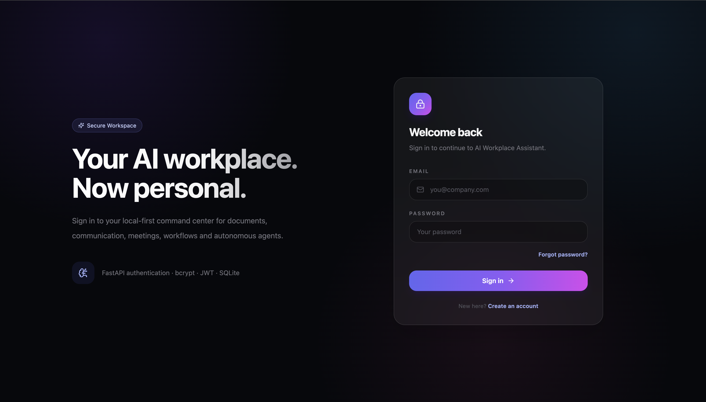
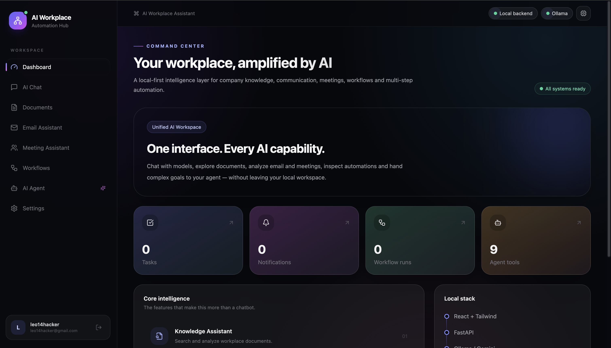

# AI Workplace Assistant

A local-first **AI Automation Hub** for workplace productivity, company knowledge, document intelligence, email analysis, meeting analysis, workflow automation, AI agents, authentication, and secure password recovery.

**Final milestone:** `v1.0.0`

## Screenshots

### Secure Login


### Dashboard


Add further screenshots later under `docs/screenshots/` for Documents, Email Assistant, Meeting Assistant, Workflows, and AI Agent.

## Features

- **AI Chat:** Ollama local LLM support with optional Gemini.
- **RAG / Knowledge Assistant:** PDF/TXT upload, extraction, chunking, embeddings, ChromaDB, semantic/hybrid search, page-aware retrieval.
- **AI Document Analyzer:** executive summary, key points, risks, action items, recommendations, page references, cached analysis.
- **AI Email Assistant:** classification, priority, sentiment, summary, tasks, deadlines, entities, risks, suggested reply, confidence.
- **AI Meeting Assistant:** summary, decisions, action items, owners, deadlines, participants, follow-up email.
- **Workflow Automation:** email/document workflows, task storage, notifications, execution history.
- **AI Agents:** document search, document/email/meeting analysis, workflow tools, safe Python utilities, reports, multi-step tool execution.
- **Authentication & Security:** JWT, bcrypt, user isolation, strong password policy, disposable-email blocking, optional organization-domain allowlist.
- **Forgot Password:** email-only reset link, expiring single-use token, token hash stored in SQLite, old JWT invalidation after reset.
- **Docker:** FastAPI + React/Nginx + persistent SQLite/uploads/ChromaDB volumes + health checks.

## Technology Stack

**Backend:** Python 3.10, FastAPI, Pydantic, Uvicorn, SQLite, PyJWT, bcrypt  
**AI/RAG:** Ollama, optional Gemini, LangChain, ChromaDB, embeddings  
**Frontend:** React, Vite, Tailwind CSS, Lucide React  
**Infrastructure:** Docker, Docker Compose, Nginx

## Project Structure

```text
AI-Workplace-Assistant/
├── backend/
│   ├── app/
│   │   ├── agents/
│   │   ├── ai/
│   │   ├── api/
│   │   ├── automation/
│   │   ├── core/
│   │   ├── prompts/
│   │   ├── rag/
│   │   ├── schemas/
│   │   ├── security/
│   │   ├── services/
│   │   ├── utils/
│   │   └── main.py
│   ├── tests/
│   ├── Dockerfile
│   ├── requirements.txt
│   └── .env.example
├── frontend/
│   ├── src/
│   │   ├── components/
│   │   ├── context/
│   │   ├── hooks/
│   │   ├── lib/
│   │   ├── pages/
│   │   ├── App.jsx
│   │   └── main.jsx
│   ├── Dockerfile
│   ├── nginx.conf
│   ├── package.json
│   └── .env.example
├── docs/
│   └── screenshots/
├── docker-compose.yml
├── Makefile
├── .env.example
├── .gitignore
└── README.md
```

# Installation

## Option 1 — Docker Compose (recommended)

### Requirements

Install Docker Desktop and Ollama.

```bash
docker --version
docker compose version
ollama --version
```

### Clone

```bash
git clone https://github.com/mitt-14/AI-Workplace-Assistant.git
cd AI-Workplace-Assistant
```

### Environment

```bash
cp .env.example .env
```

Generate a secure JWT secret:

```bash
python -c "import secrets; print(secrets.token_urlsafe(48))"
```

Place it in `.env`:

```env
JWT_SECRET_KEY=YOUR_RANDOM_SECRET
```

### Ollama

```bash
ollama pull llama3.1
ollama pull embeddinggemma
ollama list
```

### SMTP for Forgot Password

Example with Gmail SMTP:

```env
PASSWORD_RESET_DELIVERY_MODE=smtp
PASSWORD_RESET_FRONTEND_URL=http://localhost:8080
PASSWORD_RESET_EXPIRE_MINUTES=15
PASSWORD_RESET_COOLDOWN_SECONDS=60

SMTP_HOST=smtp.gmail.com
SMTP_PORT=587
SMTP_USERNAME=your-email@gmail.com
SMTP_PASSWORD=YOUR_GOOGLE_APP_PASSWORD
SMTP_FROM_EMAIL=your-email@gmail.com
SMTP_USE_TLS=true
```

Use a Google App Password, not your normal Gmail password. Never commit `.env`.

### Registration email policy

Default:

```env
EMAIL_DOMAIN_MODE=deny_disposable
BLOCK_DISPOSABLE_EMAILS=true
ALLOWED_EMAIL_DOMAINS=
```

Company-only mode:

```env
EMAIL_DOMAIN_MODE=allowlist
ALLOWED_EMAIL_DOMAINS=company.com,company.de
BLOCK_DISPOSABLE_EMAILS=true
```

### Build and run

```bash
docker compose config
docker compose up -d --build
docker compose ps
```

Open:

- Frontend: `http://localhost:8080`
- FastAPI docs: `http://localhost:8000/docs`
- Health: `http://localhost:8000/health`

Logs:

```bash
docker compose logs -f
```

Stop:

```bash
docker compose down
```

Reset all Docker data:

```bash
docker compose down -v
```

## Option 2 — Manual Development

### Backend

```bash
python -m venv .aiass
source .aiass/bin/activate
cd backend
pip install -r requirements.txt
cp .env.example .env
uvicorn app.main:app --reload
```

Backend: `http://127.0.0.1:8000`

### Frontend

```bash
cd frontend
cp .env.example .env
npm install
npm run dev
```

Frontend: `http://127.0.0.1:5173`

## Security

### Strong Password Policy

Passwords must have:
- 12–128 characters
- uppercase and lowercase letters
- number
- special character
- no whitespace
- no first name / surname
- no meaningful email-username fragments
- no common password
- no obvious sequence
- no long repeated-character run

### Password Reset

The reset flow:
1. User enters email.
2. Backend returns a generic response whether or not the account exists.
3. If the account exists, a cryptographically random reset token is created.
4. Only the token hash is stored.
5. The reset link is emailed to the registered address.
6. Token expires after 15 minutes and is single-use.
7. Successful reset invalidates older JWT sessions.

The forgot-password API never returns the raw reset token to the browser.

## Testing

Backend:

```bash
cd backend
source ../.aiass/bin/activate
pytest -q
```

Frontend:

```bash
cd frontend
npm run build
```

Docker:

```bash
docker compose config
docker compose up -d --build
docker compose ps
```

## Main API Areas

```text
/api/auth
/api/chat
/api/documents
/api/document-analysis
/api/search
/api/rag
/api/email
/api/meetings
/api/workflows
/api/tasks
/api/notifications
/api/agents
```

Interactive docs: `http://localhost:8000/docs`

## Production Notes

For a live server, update at least:

```env
ENVIRONMENT=production
PASSWORD_RESET_FRONTEND_URL=https://assistant.company.com
JWT_SECRET_KEY=NEW_PRODUCTION_SECRET
```

Also configure HTTPS, a production SMTP provider, backups, firewall rules, monitoring, and either a production Ollama host or hosted AI provider.

For production, avoid exposing FastAPI port `8000` directly to the public internet; route traffic through Nginx/HTTPS.

## Secrets — Never Commit

Never commit:

```text
.env
backend/.env
frontend/.env
SMTP passwords
Google App Passwords
Gemini API keys
JWT secrets
SQLite databases
uploaded documents
ChromaDB data
private keys
```

Only commit `.env.example` templates with placeholders.

## Completed Roadmap

```text
Phase 8   ✅ AI Document Analyzer
Phase 9   ✅ AI Email Assistant
Phase 10  ✅ AI Meeting Assistant
Phase 11  ✅ Workflow Automation
Phase 12  ✅ AI Agents
Phase 13  ✅ React Frontend
Phase 14  ✅ Authentication & User Isolation
Phase 15  ✅ Docker + Security Hardening
```

## Release

```bash
git tag -a phase-15 -m "Phase 15 - Docker, Security and Production Packaging"
git tag -a v1.0.0 -m "v1.0.0 - AI Workplace Assistant"

git push origin phase-15
git push origin v1.0.0
```

## Author

**Miten Gabani**

AI Workplace Assistant — local-first AI automation and workplace intelligence platform.
